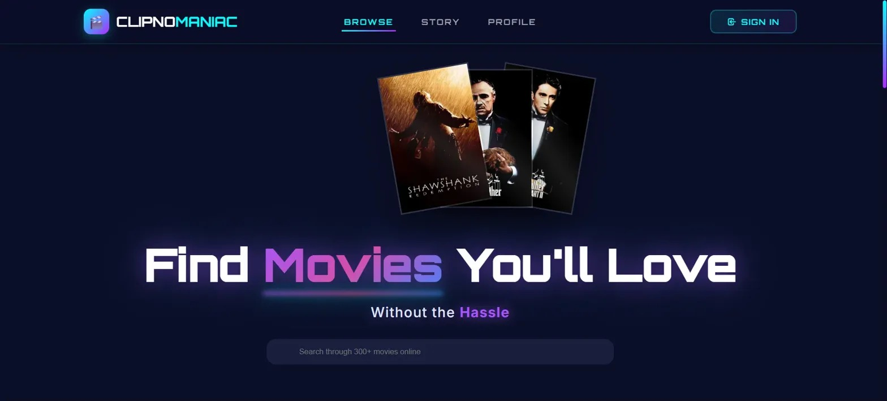
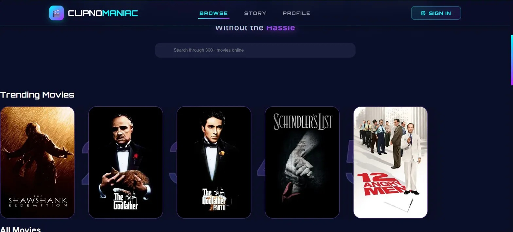
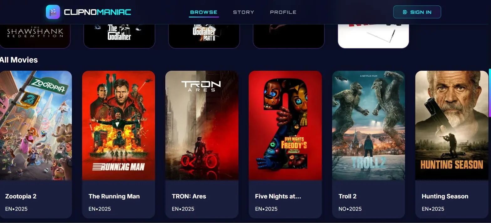

# 🎬 ClipNoManiac

> A futuristic movie discovery platform built with React, TypeScript, and TMDB API

[](LICENSE)
[](https://reactjs.org/)
[](https://www.typescriptlang.org/)
[](https://vitejs.dev/)



## ✨ Features

- 🎯 **Discover Movies**: Browse through 300+ movies from TMDB
- 🔍 **Smart Search**: Real-time search with debouncing
- ⭐ **Trending Section**: See what's hot right now
- 🎨 **Futuristic UI**: Modern, animated interface with neon aesthetics
- 📱 **Fully Responsive**: Works seamlessly on all devices
- 🌙 **Dark Mode**: Easy on the eyes with beautiful gradients
- ⚡ **Fast Performance**: Built with Vite for lightning-fast load times

## 🖼️ Screenshots

### Hero Section


### Browse Movies


### Movie Cards


## 🚀 Quick Start

### Prerequisites

- Node.js 18.x or higher
- npm or yarn
- TMDB API Key ([Get one here](https://www.themoviedb.org/settings/api))

### Installation

1. **Clone the repository**
```bash
   git clone https://github.com/SajidenOfnir/clipnomaniac.git
   cd clipnomaniac
```

2. **Install dependencies**
```bash
   npm install
```

3. **Set up environment variables**
```bash
   cp .env.example .env
```
   
   Edit `.env` and add your TMDB API key:
```env
   VITE_TMDB_API_KEY=your_api_key_here
   VITE_TMDB_BASE_URL=https://api.themoviedb.org/3
   VITE_TMDB_IMAGE_BASE_URL=https://image.tmdb.org/t/p/w500
```

4. **Start the development server**
```bash
   npm run dev
```

5. **Open your browser**
   Navigate to `http://localhost:5173`

## 📦 Build for Production
```bash
npm run build
npm run preview  # Preview production build
```

## 🛠️ Tech Stack

- **Frontend Framework**: React 18
- **Language**: TypeScript
- **Build Tool**: Vite
- **Styling**: Tailwind CSS
- **State Management**: Zustand (optional)
- **Routing**: React Router v6
- **HTTP Client**: Fetch API
- **API**: The Movie Database (TMDB)
- **Fonts**: Orbitron, Inter

## 📂 Project Structure
src/
├── components/      # Reusable UI components
├── features/        # Feature-based modules
├── hooks/           # Custom React hooks
├── services/        # API services
├── types/           # TypeScript type definitions
└── utils/           # Utility functions

## 🎨 Key Features Explained

### Futuristic Design
- Animated gradient backgrounds
- Neon color scheme (Cyan, Purple, Pink)
- Glass morphism effects
- Smooth transitions and hover effects

### Performance Optimizations
- Image lazy loading
- Code splitting
- Debounced search
- Optimized re-renders

### Responsive Design
- Mobile-first approach
- Breakpoints: 640px, 768px, 1024px
- Hamburger menu for mobile
- Adaptive layouts

## 🤝 Contributing

Contributions are welcome! Please read [CONTRIBUTING.md](CONTRIBUTING.md) for details.

1. Fork the repository
2. Create your feature branch (`git checkout -b feature/AmazingFeature`)
3. Commit your changes (`git commit -m 'Add some AmazingFeature'`)
4. Push to the branch (`git push origin feature/AmazingFeature`)
5. Open a Pull Request

## 📝 License

This project is licensed under the MIT License - see the [LICENSE](LICENSE) file for details.

## 🙏 Acknowledgments

- [TMDB](https://www.themoviedb.org/) for the movie database API
- [Lucide](https://lucide.dev/) for icons
- [Tailwind CSS](https://tailwindcss.com/) for styling
- [Vite](https://vitejs.dev/) for the build tool

## 📧 Contact

**Sajiden Ofnir**  
GitHub: [@SajidenOfnir](https://github.com/SajidenOfnir)

---

⭐ If you like this project, please give it a star!
